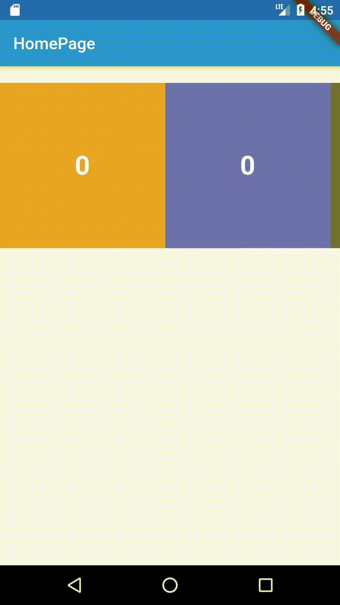

# mobilechallenge

A new Flutter project.

## Get the Flutter SDK (https://flutter.dev/docs/get-started/install/macos)
1. Download the following installation bundle to get the latest stable release of the Flutter SDK: (https://storage.googleapis.com/flutter_infra/releases/stable/macos/flutter_macos_v1.2.1-stable.zip)
2. Extract the file in the desired location, for example:
-  cd ~/Downloads
-  unzip ~/Downloads/flutter_macos_v1.2.1-stable.zip
3. Add the flutter tool to your path:
    export PATH="$PATH:`pwd`/flutter/bin"
## Install Android Emulator
- Download and Install Genymotion: (https://www.genymotion.com/desktop/)
- At the top right corner -> click [Trial]
- Create a account 
- Then Click [Get Genymotion]
- Install Genymotion and download Virtual Machine
- Open Virtual Machine
## Install IDE 
- Both Android Studio or Visual Studio Code can also use.
> **Android Studio**
- Open an existing project -> Cloned project
- Press Control + R to run the app
> **Visual Studio Code**
- File -> Open -> Cloned project
- Terminal -> New Terminal
- Type 'flutter run' 
    + If 'zsh: command not found: flutter' is occurred, make sure the PATH setting is correct
    + Else the app will deploy to Emulator

## DEMO
 
